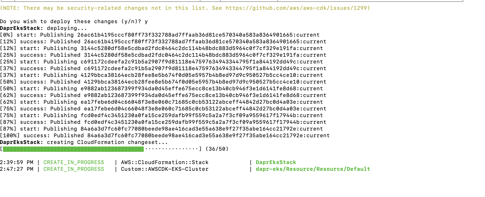
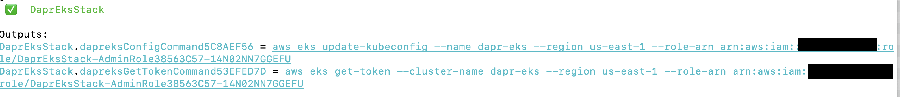
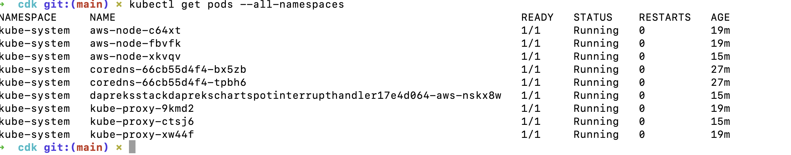
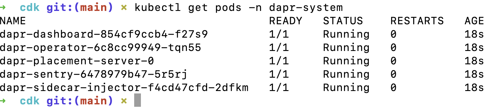
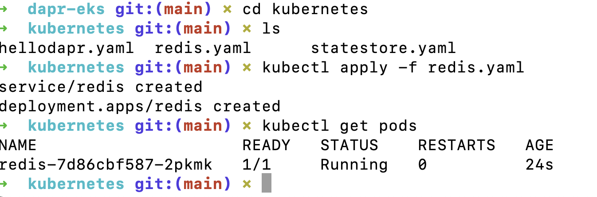
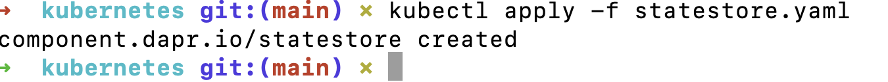
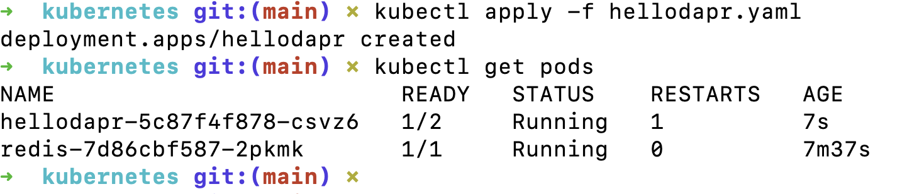
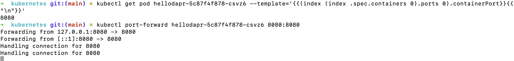
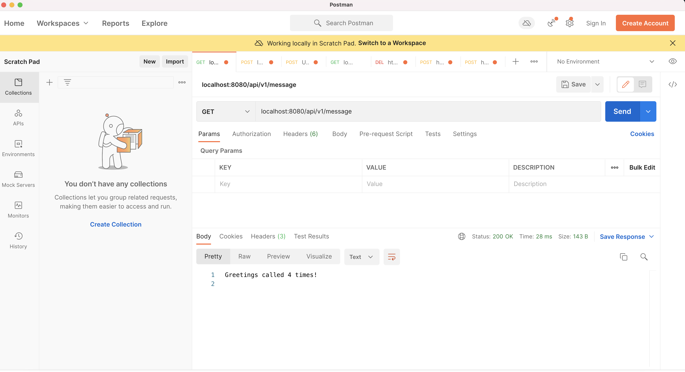
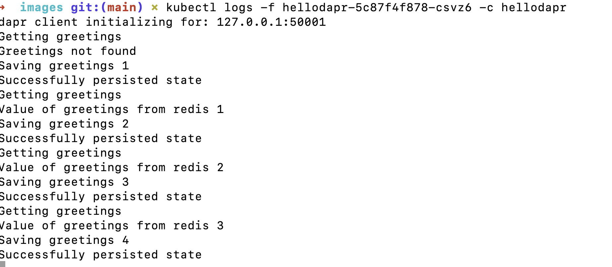

# Dapr Application on AWS EKS

This project contains a Dapr application with a Redis datastore. The application is deployed on Amazon Elastic Kubernetes Service ([Amazon EKS](https://docs.aws.amazon.com/eks/latest/userguide/what-is-eks.html)). The [AWS CDK](https://docs.aws.amazon.com/cdk/latest/guide/home.html) is used to create the AWS EKS.

## Prerequisites

You will need the following prerequisites installed in order to build and deploy the this project.

### Node.js

The AWS CDK uses Node.js (>= 10.3.0).  To install Node.Js, follow the instructions in the [Node.js](https://nodejs.org/en/download/) website.

### Typescript

This project is developed in Typescript. Install Typescript using the following command.

```
npm install -g typescript
```

Verify that Typescript was installed correctly.

```
tsc --version
```

### AWS CLI

The AWS CLI is a tool to manage your AWS services from a terminal session. Follow the steps to install the AWS CLI [here](https://aws.amazon.com/cli).

### AWS CDK

Install the AWS CDK using the following command.

```
npm install -g aws-cdk
```

Verify that the AWS CDK was installed correctly.

```
cdk --version
```

### Dapr

The Dapr CLI allows you to setup Dapr on the Kubernetes cluster we will create.  Follow the instructions [here](https://docs.dapr.io/getting-started/install-dapr)

For MacOS, run the following command

```
curl -fsSL https://raw.githubusercontent.com/dapr/cli/master/install/install.sh | /bin/bash
```

## Build and Deploy AWS EKS

The [cdk](./cdk/) directory contains the AWS resources for the EKS stack.  Follow the steps below to deploy EKS.

### Step 1 - Install the EKS CDK node dependencies

```
npm install
```

### Step 2 - Compile typescript to js

```
npm run build
```

### Step 3 - Bootstrap the stack to your default AWS account/region

```
cdk bootstrap
```

### Step 4 - Deploy this stack to your default AWS account/region

```
cdk deploy
```

You should see something like the following.



### Step 5 - Update kubeconfig

After the resource creation is completed, you should see the following message.  Copy the `aws eks update-kubeconfig` section and run it in the terminal.



Execute the following AWS CLI commands using the output from above.

```
aws eks update-kubeconfig --name dapr-eks --region us-east-1 --role-arn arn:aws:iam::<ACCOUNT>:role/DaprEksStack-AdminRole38563C57-14N02NN7GGEFU
```

```
aws eks get-token --cluster-name dapr-eks --region us-east-1 --role-arn arn:aws:iam::<ACCOUNT>:role/DaprEksStack-AdminRole38563C57-14N02NN7GGEFU
```

Test to make sure everything is configured correctly

```
kubectl get pods --all-namespaces
```



### Step 6 -  Install Dapr on Kubernetes

```
dapr init -k

⌛  Making the jump to hyperspace...
ℹ️  Note: To install Dapr using Helm, see here: https://docs.dapr.io/getting-started/install-dapr-kubernetes/#install-with-helm-advanced

✅  Deploying the Dapr control plane to your cluster...
✅  Success! Dapr has been installed to namespace dapr-system. To verify, run `dapr status -k' in your terminal. To get started, go here: https://aka.ms/dapr-getting-started
```

Make sure things are running

```
kubectl get pods -n dapr-system
```



## Dapr app

The [application](./dapr-app/main.go) that we're goin to deploy is a simple web server listening on port 8080.  An HTTP GET request at `/api/v1/message` will return the string “Greetings called `number` times!”  The `number` is incremented every time a request is made.  The number of requests is stored in Redis.  The application uses the [Dapr Go SDK](https://github.com/dapr/go-sdk) to communicate with Redis via the Dapr client.

### Step 1 - Configuring Redis as the Persistence Layer

```
cd kubernetes
kubectl apply -f redis.yaml
kubectl get pods
```



### Step 2 - Deploy Dapr State Store

```
kubectl apply -f statestore.yaml
```



### Step 3 - Deploy Dapr App

```
kubectl apply -f hellodapr.yaml
```



## The Fun Stuff

Now that we have our EKS cluster up and running and the Dapr application deployed, lets test it out. We will use [port forwarding](https://kubernetes.io/docs/tasks/access-application-cluster/port-forward-access-application-cluster/) to connect to the `hellodapr` pod running in the AWS EKS cluster. After we forward our local port to the port on the Kubernetes POD, we will use Postman to issue HTTP GET requests.

### Step 1 - Port Forwarding

First confirm that the hellodapr pod is listening on port 8080.

```
kubectl get pod hellodapr-5c87f4f878-csvz6 --template='{{(index (index .spec.containers 0).ports 0).containerPort}}{{"\n"}}'
```

The output displays the port for hellodapr in that Pod, which should be 8080.

Now issue the following port forwarding command.

```
kubectl port-forward hellodapr-5c87f4f878-csvz6 8080:8080
```



### Step 2 - Tail the logs

In a new terminal, issue the following command to tail the logs from hellodapr.

```
kubectl logs -f hellodapr-5c87f4f878-csvz6 -c hellodapr
```

### Step 3 - Postman

Launch Postman and issue a couple of HTTP GET requests to `localhost:8080/api/v1/message`.



Check the logs to see the output.



## Cleanup

Make sure to clean up the AWS resources.

```
cdk destroy
```